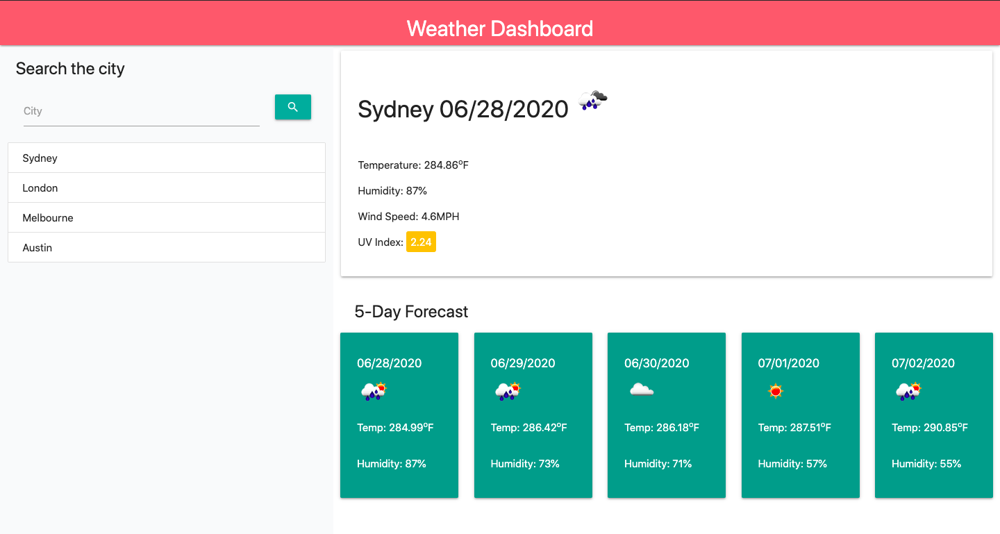

# Weather-App

## Description

Search a city and get its weather details!

When you search a city, the temperature, humidty, wind speed and UV index is displayed together with today's date and weather icon. The weather icon represents the weather depending on the weather condition (e.g. cloud icon for a cloudy day). The UV index has a colour scale:
- Green = favourable (UV <= 2)
- Amber = moderate (2 < UV > 8) 
- Red = severe (UV >= 8)
 
The weather forecast for the next 5 days are also displayed underneath with the corresponding date, weather icon, temperature and humidity.

Previously searched cities can be viewed again by clicking on the city in the list underneath the search bar. It can even be viewed again when the page is reloaded!

## Usage

## Search the Weather!

https://acho9138.github.io/Weather-App/

## Credits

Thank you to the following resources to help make this waether app possible:

- The Coding Bootcamp at University of Sydney
- Moment.js
- MDN
- Stack Overflow
- w3schools.com
- MaterializeCSS
- jQuery